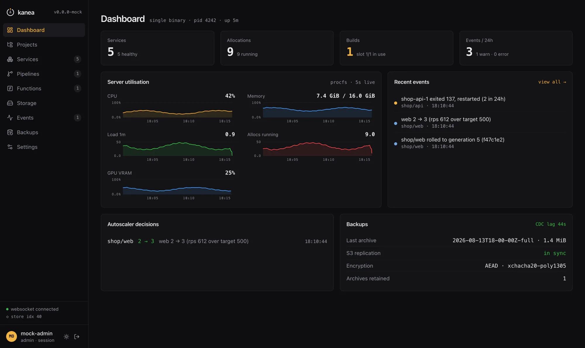

<div align="center">

<h1 align="center">
  <picture>
    <source media="(prefers-color-scheme: dark)" srcset="./logo/kanea-mark-dark.svg">
    
  </picture>
  &nbsp;Kanea
</h1>

<p align="center"><strong>Container orchestration in one binary.</strong></p>



Kanea is a lightweight container orchestration platform written in Go. Services run on **containerd**, networking and load balancing are **Kanea's own eBPF datapath**, TLS comes from **Let's Encrypt, a per-node CA, or certificates you already have**, and it ships a real-time **shadcn/ui dashboard**, an **MCP server** for AI agents, **GitOps pipelines** (rootless BuildKit), **eBPF-driven autoscaling**, and **encrypted S3-backed state replication** with backup and restore.

[](https://github.com/m18h/kanea/actions/workflows/ci.yml) [](https://github.com/m18h/kanea/actions/workflows/release.yml) [](https://github.com/m18h/kanea/releases/latest) [](./LICENSE) [](./go.mod)

**[Website](https://m18h.github.io/kanea/)** · [PRD](./PRD.md) · [Threat model](./docs/THREAT_MODEL.md) · [DR runbook](./docs/DR_RUNBOOK.md)

</div>

## Install

```bash
curl -fsSL https://m18h.github.io/kanea/install.sh | sudo bash
```

The installer fetches the binary, verifies it, and stops. Checksum verification is
mandatory and there is no flag to skip it; the Sigstore signature is verified too
when `cosign` is on `PATH` - and a signature that is *present and invalid* is
fatal, not a warning. It generates no keys, starts nothing, and writes no units.

It takes no arguments. The three knobs are environment variables, and `sudo` does
not forward them by default, so pass them to `bash` itself:

| Variable | Default | Meaning |
|---|---|---|
| `KANEA_VERSION` | `latest` | Release tag to install, e.g. `vX.Y.Z` |
| `KANEA_PREFIX` | `/usr/local/bin` | Where the binary goes |
| `KANEA_REPO` | `m18h/kanea` | The `owner/repo` releases come from |

```bash
curl -fsSL https://m18h.github.io/kanea/install.sh | sudo KANEA_VERSION=vX.Y.Z bash
```

A non-Linux kernel, an architecture outside amd64/arm64, and a repository with no
published release are all refused before anything is downloaded. The full
walk-through - an annotated `kanea init` run, what a re-run keeps, the host
components, upgrades and air-gapped nodes - is in the
[installation docs](https://m18h.github.io/kanea/docs/#install).

`kanea init` then installs the runtime (containerd, `runc` and rootless
`buildkitd`) at versions pinned by SHA-256 in the binary (PRD §5.2.12). The
network layer needs no component: the eBPF datapath is compiled into `kanea`
itself (§5.2.5). It installs under its own prefix on its own socket, so a node that
ran Docker yesterday runs it tomorrow.

Prefer to do it by hand? Every release publishes
`kanea_<version>_linux_<arch>.tar.gz`, an **SPDX SBOM** beside each archive
(plus `kanea_<version>_source.spdx.json` for the build's own graph, which is
where the embedded dashboard's npm dependencies are listed), `checksums.txt`,
and a **keyless cosign** signature over the checksums. The SBOMs are listed in
the checksums, so that one signature covers them too:

```bash
VERSION=v0.28.0; ARCH=amd64
BASE=https://github.com/m18h/kanea/releases/download/$VERSION

curl -fLO $BASE/kanea_${VERSION#v}_linux_$ARCH.tar.gz
curl -fL -O $BASE/checksums.txt -O $BASE/checksums.txt.sig -O $BASE/checksums.txt.pem

cosign verify-blob \
  --certificate checksums.txt.pem \
  --signature   checksums.txt.sig \
  --certificate-identity-regexp "https://github.com/m18h/kanea/" \
  --certificate-oidc-issuer "https://token.actions.githubusercontent.com" \
  checksums.txt

sha256sum --ignore-missing -c checksums.txt
tar xzf kanea_${VERSION#v}_linux_$ARCH.tar.gz
sudo install -m 0755 kanea /usr/local/bin/kanea
```

There is no long-lived signing key to guard: the signature is bound by Sigstore to
the release workflow in this repository, and the proof is in a public transparency
log.

### Homebrew (CLI)

```bash
brew tap m18h/kanea
brew trust m18h/kanea   # brew ≥ 6 refuses formulae from untrusted third-party taps
brew install kanea
```

Homebrew ships the CLI, not the node (PRD §5.2.12) - but the CLI is not the
authoring half any more. `kanea plan` still validates job specs with
file-and-line diagnostics and needs no daemon at all, and with `KANEA_URL` and
a token the same binary drives a remote node completely: deploy, ps, logs,
exec, scale. A Mac is a first-class client; it is just never the *node*, which
belongs to the script above: root-owned at `/usr/local/bin`, where
`kanea upgrade` owns the swap. A brew-owned binary upgrades with `brew upgrade kanea`, then
`sudo kanea upgrade --no-fetch` for the restart-and-migrate half. The formula
lives in its own tap repository, [m18h/homebrew-kanea](https://github.com/m18h/homebrew-kanea),
and is regenerated from each release's `checksums.txt` by a workflow there;
the macOS install works from the first release that ships darwin archives.

### Container image (CI)

```bash
docker run --rm ghcr.io/m18h/kanea:latest version

# the shape a pipeline uses: the spec on a mount, the node over the network
docker run --rm -v "$PWD:/workspace:ro" \
  -e KANEA_URL -e KANEA_TOKEN \
  ghcr.io/m18h/kanea:vX.Y.Z run shop.hcl   # pin it; that is what tags are for
```

`linux/amd64` and `linux/arm64` in one manifest list, tagged `vX.Y.Z` and
`latest`; `latest` moves only for a plain `vX.Y.Z`, so a prerelease never
becomes what everyone pulls by default. Like Homebrew, it ships the CLI and not
the node (PRD §5.2.12): it is for the pipeline that deploys *to* a node, so
`agent`, `edge`, `init`, `install`, `doctor` and `upgrade` - every verb that
acts on a host, its systemd and its own binary - are not what it is for.

The image carries the binary out of the release archives above, not a separate
build of them, so the `checksums.txt` you can verify by hand describes what is
inside it. The image digest is cosign-signed with the same keyless identity and
carries an SPDX attestation:

```bash
cosign verify ghcr.io/m18h/kanea:vX.Y.Z \
  --certificate-identity-regexp 'https://github.com/m18h/kanea/' \
  --certificate-oidc-issuer 'https://token.actions.githubusercontent.com'
```

It runs as an unprivileged user (uid 65532) out of `/workspace`. If your
network terminates TLS with its own CA, drop the root into
`/usr/local/share/ca-certificates` and run `update-ca-certificates` in a
derived image - or pass the node's own CA with `KANEA_CA_CERT`, which replaces
the system pool rather than adding to it.

## Quickstart

```bash
# 1. Check the node, install the runtime, run the master-key ceremony,
#    write the units, start kanead, and create your admin account. Init
#    asks for a dashboard address (loopback by default) and a username,
#    then prints where everything is. The master key is shown once, so
#    have somewhere to record it before you start.
sudo kanea init

# 2. Deploy something.
kanea run --image nginx:1.27-alpine --name web --project demo
kanea ui
```

The CLI talks to `kanead` over a root-owned socket. To use it without sudo, join
the `kanea` group init created and log in again. Membership is root-equivalent,
exactly like docker's group:

```bash
sudo usermod -aG kanea $USER
```

Init ends with the node summary: the dashboard URL, your admin account, the
internal DNS address and the subnet layout. TLS is required beyond loopback,
and init provisions it by default: a public listen address - answered at the
prompt or passed as a bare `--listen` - mints a 10-year self-signed pair at
`/etc/kanea/api.crt` and serves the API and dashboard with it. Bring your own
with `--listen-cert`/`--listen-key`, or override the default at any time via
the server config below. `--admin-user` and a piped
password make it scriptable; `--no-start` writes the files and stops, which is
the pre-v0.5 behaviour.

The listener can live in the server config instead of the unit (PRD §15.1),
with its TLS in the same vocabulary services use:

```hcl
# /etc/kanea/kanea.hcl
bind {
  api_addr   = "192.168.1.10:8600"
  api_tls    = "self-signed"       # or: acme (with api_domain), provided, plaintext
  # api_domain = "kanea.home.example"  # acme needs it; names a self-signed cert
  # api_cert   = "/etc/kanea/api.pem"  # provided only, always with api_key
  # api_key    = "/etc/kanea/api.key"
}
```

`self-signed` issues the listener's certificate from the node's own CA (the
one `kanea ca show` installs on your devices) with a real IP SAN, renewed
automatically; `acme` gets a Let's Encrypt certificate for `api_domain`
through the same account and renewal loop your services use; `provided` is
your own `api_cert`/`api_key` pair; `plaintext` is explicit HTTP, allowed
beyond loopback because you typed it and logged loudly. Init then skips the
listen question and renders no listen flags. Moving the API and dashboard later
is an edit to the file plus `systemctl restart kanead`, never a re-init. An
explicit `--listen` always wins, and `--listen none` keeps the node
socket-only regardless.

### On a home network

No public name, no port 80 reachable from the internet, and still real HTTPS. Point
a wildcard DNS record (`*.home.lan`) at the node on your local resolver, run the
control plane with a local CA, and install that CA once on each device.

`--base-domain` and `--tls-default` are daemon flags that `kanea init` does not write into the unit, so they go
in a drop-in (`sudo systemctl edit kanead`), which also survives re-running init:

```ini
[Service]
ExecStart=
# copy the existing line from `systemctl cat kanead`, then append:
ExecStart=/usr/local/bin/kanea agent … --base-domain home.lan --tls-default self-signed
```

```bash
sudo systemctl daemon-reload && sudo systemctl restart kanead
kanea ca show > kanea-ca.crt      # install on your phone, laptop, TV
```

Every service then answers at `<service>.<project>.home.lan` over HTTPS, with no
CA to reach and no rate limit to spend. `--tls-default` also takes `acme`,
`provided` (certificates you put on the node, granted per project through
`--tls-certs-config`) and `plaintext`. A spec can override the node with
`expose { tls { mode = "…" } }`. A mode names a source, never a path.

Prefer a port to a name? Publish one, with or without a domain:

```hcl
network {
  port "http" { container = 8096 }

  publish "http" {
    host = 8096                                    # http://<node>:8096
    ip_restriction { allow = ["192.168.0.0/16"] }
  }
}
```

The full DNS story - internal `<service>.<project>` names, the public records you
create, HTTP-01 versus DNS-01, and split-horizon setups - is in the
[names and DNS docs](https://m18h.github.io/kanea/docs/#dns).

`mode = "tcp"` relays bytes instead, for Postgres, a game server, or anything
else that is not HTTP. Which ports a spec may claim is the node's decision
(`--publish-ports`, unprivileged by default), because a repository anyone can
push to must not be able to take :22.

### Granting what specs may use

Host directories and device/GPU passthrough are off until the node's owner says
otherwise: a spec *names* what it wants, and the node decides what is allowed.
Both grants live in one file, `/etc/kanea/kanea.hcl`, read once at daemon start
(`kanea init` already created the directory; no unit editing, and re-running
init never touches it):

```hcl
# /etc/kanea/kanea.hcl: the node's, never the repository's
storage {
  allowed_host_paths = ["/srv/kanea", "/dev/shm"]  # parents `host` volumes may use
}

device "gpu" {
  nodes = ["/dev/dri/card0", "/dev/dri/renderD128"]
  allow = ["media"]                                # projects that may claim it
}
```

```bash
sudo systemctl restart kanead                      # read once, at startup
```

Keep it root-owned and `0644`, because kanead refuses a policy file anyone else
could have written. A spec then mounts with `storage "x" { type = "host" path = … }`
and claims the GPU with `device "dri" { grant = "gpu" }`; a grant the node does
not hold fails the alloc rather than starting without it.

A host path must already exist, so a typo cannot become a silently empty volume.
Add `create = true` to the storage block when you would rather Kanea made it,
still only inside a prefix you allowed above.

### The server config

`/etc/kanea/kanea.hcl` is the file both of the blocks above live in: the node's
settings, as opposed to a job spec's. A spec can *reference* what it permits and
can never add to it, which is the point - GitOps deploys specs automatically, so
anything a spec could declare, anyone who can push to a synced repo could
declare. It does not exist by default, and `kanea init` never writes it.

Six stanzas are read:

| Stanza | What it decides |
|---|---|
| `bind` | Where the API and dashboard listen, and how that listener gets its certificate |
| `storage` | Which host directories a `host` volume may mount (`allowed_host_paths`) |
| `dns` | Which resolvers the internal DNS forwards to (`upstreams`) |
| `variables` | Node-wide defaults for spec variables - **never secrets**: `GET /v1/vars` serves them to any authenticated caller |
| `device` | A named device grant: `nodes`, `allow`, optional `mode` |
| `socket` | A named socket grant: `path`, `allow` |

Four rules are worth knowing before you edit it:

- **Read once, at daemon start.** No poll, no reload, no `SIGHUP`.
- **Absent is off; malformed is fatal.** There is no keep-last-good and no
  partial load, so a typo stops kanead starting. Fix the file and restart, or add
  `--config off` to the unit to get the node up without it.
- **It is trust-checked before it is parsed** - a regular file, owned by root or
  the daemon's uid, writable only by its owner. World-*readable* is fine; it is
  policy, not a secret.
- **An unknown stanza is a warning** (named at startup, so a future version's
  settings can sit there), **but an unknown attribute inside a read stanza is an
  error** - there it is almost always a typo, and a silently ignored
  `allowed_host_path` would be a security control that quietly did nothing.

Applying an edit is the same for every stanza:

```bash
sudo systemctl restart kanead
```

`daemon-reload` is not part of it: that is for unit changes. The restart is
cheaper than it looks - **running workloads keep running** (`KillMode=process`)
and **ingress keeps serving** (`kanea-edge` is a separate process with no
`After=` either way). What pauses is *change*: deploys, scaling, certificate
renewal, the API and dashboard. Afterwards, `journalctl -u kanead | grep 'server
config'` shows whether it loaded, whether a stanza is being ignored, and whether
a flag on the unit is overriding it.

Every half has a flag that wins over the file, and the disable words are not the
same - `--listen none`, but `off` for `--config`, `--allowed-host-paths` and
`--passthrough-config`. The full reference, with every field and refusal, is in
the [node configuration docs](https://m18h.github.io/kanea/docs/#nodeconfig).

### Seeing what an apply would do

`kanea plan` renders one block per service and one row per resource that would
be added, changed or removed - volumes, routes, published ports, config files,
device and socket grants, env keys, init steps, the health check, the
autoscaler - and marks the rows that **replace running containers**, because
that is the difference between a config edit and a rolling restart:

```
$ kanea plan app.hcl
~ update shop/web
    image             web:v1 -> web:v2  (rolls allocs)
    env               + DB_URL, ~ LOG_LEVEL  (rolls allocs)
    volumes           + cache  s3:backups /var/cache rw 10 GiB budget  (rolls allocs)
    expose            + api.example.com  (tls acme, port 8080)

+ create shop/worker (count 2, image worker:v3)
    volumes           + queue  local /queue
    files             + /etc/app.conf  (412 B, content 3f2a1b9c, mode 0644)

Plan: 2 change(s) - 1 create, 1 update; 1 replace running allocs.
Run `kanea run` to apply.
```

`kanea run` prints the same block from the same code - so what you confirm is
what you were shown - and then asks:

```
Apply? [Y/n]
```

Enter applies. `--yes` (or `-y`) skips the question, and **stdin that is not a
terminal is never prompted**: a piped or redirected stdin is a script, so every
CI recipe and pipeline written before this keeps working exactly as it did.

Two things never appear in the output whatever changed: an env **value**, since
it may be a `secret-env:` reference, and a config file's **content**, since it
carries secret placeholders. Keys, paths and a short content digest are what
make an edit visible without printing the secret.

### Removing a service

An apply is additive: deleting a `service` block and re-applying leaves the
service running, so `kanea run web.hcl` can never delete what `db.hcl`
declares. To drop what a spec no longer declares:

```bash
kanea plan --remove-orphans app.hcl   # `- destroy` lines for what would go
kanea run  --remove-orphans app.hcl
```

The spec becomes authoritative for the projects it declares a `project` block
for; projects it does not mention are never touched. It is **refused with a
selector or `--image`** - a selector sends part of the spec and `--image`
declares no project, so neither can claim to be the whole of one. For a single
service, `kanea stop shop/web --rm`.

**Volume data is never deleted.** A service pruned by mistake comes back with
its data by re-applying it; a deliberate prune frees no disk. What does go: the
containers, the alloc records, the VIP, routes and mounts. Each removal emits
`service.removed` and is named in the audit log.

### Volumes

`kanea volume list` shows every storage resource with the mounts using it, their
measured usage and mount state. A `volume` block may declare `size = "10GiB"`,
which is a **budget rather than a quota**: Kanea measures the volume against it
and emits `volume.over_budget` (and `volume.under_budget` when it recovers), but
nothing enforces it: no quota mechanism exists on the node, and `nfs`, `smb`
and `s3` could not carry one anyway. Mounts notify too: `volume.mount_failed`
when one will not establish or stops answering, `volume.mount_recovered` when
the supervisor gets it back.

### Setup before a service starts

A schema migration, a `chown` of a directory Kanea just created, a config
render: an `init` block runs to completion before the workload starts.

```hcl
service "api" {
  project = "shop"

  init "migrate" {
    image   = "registry.example.com/shop/api-migrate:1.4"
    command = ["/bin/migrate", "up"]
    env     = { DATABASE_URL = "secret:shop/database-url" }
    timeout = "5m"
  }

  task "app" {
    image = "registry.example.com/shop/api:1.4"
    ...
  }
}
```

**A sequence runs once per service, not once per alloc.** It runs on the first
alloc; the others wait for it and then start with no sequence of their own, so
`count = 3` means three replicas and one migration. The gate is that alloc's
record leaving `init` *at the same spec hash*, so a deploy re-runs it once and
the others wait again. A waiting alloc says what for, on `kanea ps`.

The cost is per-alloc volumes: local storage gives each alloc its own
directory, so a step preparing *this alloc's* volume (the classic `chown`) now
prepares the first alloc's and no other. `kanea plan` warns when a service with
`count > 1` declares both init steps and a local volume; steps that work on
shared state are unaffected.

Steps run in declaration order, one at a time, and the task starts only once
the last has exited zero. They share the alloc's network namespace, volumes and
secrets, and **must be idempotent**: a half-run sequence is abandoned rather
than resumed.

### Sharing an environment

`variables` substitutes `${name}` into text you write, so putting `LOG_LEVEL`
into ten services still means writing the key ten times. An **env group** is
declared once and *taken*:

```hcl
env_group "common" {
  LOG_LEVEL = "info"
  REGION    = "eu-central-1"
}

env_group "db" {
  DATABASE_HOST = "${service.postgres.host}"
  DATABASE_URL  = "secret:shop/database-url"
}

service "api" {
  project  = "shop"
  env_from = ["common", "db"]

  task "app" {
    image = "registry.example.com/shop/api:1.4"
    env   = { LOG_LEVEL = "debug" }     # the service's own env wins
  }
}
```

Blocks run **in declaration order, one at a time**, and the task is created only
once the last has exited zero. Each step shares the alloc's network namespace
(so `${service.postgres.host}` resolves, which is what makes a wait-for-database
step possible), its volumes, and its secrets - and declares everything else for
itself: its own image, command, env, resources, `user` and capabilities. Running
as root to fix a directory the task will own as uid 999 is the canonical use, so
nothing is inherited from `task`.

A step's output is its own: `kanea logs shop/api -c migrate`. A step that runs
and fails, or outlives its `timeout`, fails the alloc and spends the restart
budget, so a broken migration stops after `attempts` instead of hammering a
database; a step that could not be *pulled* is retried without spending it,
because nothing ran.

**Init containers must be idempotent.** A half-run sequence is abandoned rather
than resumed, and a sequence re-runs on every alloc creation - a deploy, a crash
restart, a spec change - for the same reason the namespace and the secrets are
rebuilt.

### Where images come from

`pull_policy` on a `task` or an `init` block says whether Kanea may reach a
registry: `if-not-present` (the default), `never`, or `always`.

`never` is for a node whose images are already there - see [air-gapped
nodes](#air-gapped-nodes) - where the default's pull-and-fail blames a registry
the node was never going to contact. Set the node-wide default in
`/etc/kanea/kanea.hcl`:

```hcl
images {
  pull_policy = "never"
}
```

`always` does **not** re-pull at every container creation; that would let two
replicas of one spec run different bytes. It turns on image auto-update, so the
tag is polled, a moved digest is pinned, and **every replica rolls together**
through `max_parallel`, `min_healthy` and the health check. It is task-only, and
inherits auto-update's rules: not beside a `build` block, a tag rather than a
digest.
Groups apply in the order `env_from` lists them, and each container's own `env`
wins over all of them - the task's and every [init step](#setup-before-a-service-starts)'s,
because `env_from` is a statement about the service rather than about one
container. It is **opt-in per service** rather than project-wide on
purpose: env is baked into a container, so a shared value changing rolls every
service that takes it - and that blast radius should be something the spec
states, not something a service inherits by living in a project.

A group is evaluated **once per service that takes it**, which is why
`${service.postgres.host}` inside one resolves to the *taking* service's project
and creates that service's dependency edge. A `secret:` in a group is checked
against every consumer, so a group carrying `shop`'s credential is refused for a
service in another project.

### Config files

Content Kanea places in the container, instead of baking it into an image or
mounting a host volume and putting the file there yourself:

```hcl
service "web" {
  project = "shop"

  file "nginx" {
    path   = "/etc/nginx/conf.d/app.conf"
    source = "./nginx.conf"        # read when the spec is parsed, embedded
  }

  file "pgpass" {
    path    = "/etc/app/pgpass"
    mode    = "0400"
    content = "db:5432:app:${secret.shop["database-password"]}"
  }
}
```

`content` is an ordinary HCL string, so a whole config file goes in a heredoc,
which is the shape most files actually take:

```hcl
file "app-config" {
  path    = "/etc/app/config.yaml"
  content = <<-EOT
    server:
      addr: ":8080"
      upstream: "${service.api.host}:${service.api.port.http}"
    database:
      dsn: "postgres://app:${secret.shop["database-password"]}@db:5432/app"
    log:
      # a literal dollar-brace the app expands itself
      format: "$${level} $${msg}"
  EOT
}
```

Both interpolations work in the same file, and it is the secret that decides the
rest: because one line names one, the whole file is written `0400` on a tmpfs of
its own. Content that has template syntax of its own is escaped `$${…}`, which
is HCL's rule rather than Kanea's.

Files are mounted read-only, `nosuid,noexec,nodev`, after volumes - so a file at
a path inside a volume wins. Init steps see them too; a step that renders or
validates config is a real use, and a step gets its own copy of a
secret-bearing file so it can read one owned by its own user. An execute bit in `mode` is refused: a `file` block
delivers configuration, not a program.

**A secret in a file's content never enters Kanea's state.**
`${secret.<scope>.<name>}` resolves at parse to an opaque placeholder; the
record keeps the *reference*, exactly as it does for an env var, and the value
is substituted on the node when the container is created. So a rotation lands at
the next replacement, and the credential is not in the Store, in a backup
archive, or in `GET /v1/services`. A file carrying one is placed 0400 on a tmpfs
of its own, owned by the workload's user.

Two things worth knowing before you write one. `${...}` is HCL's own
interpolation, so a literal dollar-brace - which nginx and prometheus configs
are full of - is written `$${...}`. And `source` is read **where the spec is
parsed**: from the directory beside the file for `kanea run`, and out of the
commit for a synced repository. The dashboard's spec editor parses text rather
than files, so it refuses `source` and wants `content`.

Content is capped at 64 KiB per file and 128 KiB per service: a service record
is replicated in full on every deploy.

### Shared variables

Declare a value once and reference it anywhere in a spec as `${name}`, or as a
bare identifier where HCL takes an expression:

```hcl
variables {
  domain   = "shop.example.com"
  replicas = 3
}

service "web" {
  project = "shop"
  count   = replicas
  expose { domains = ["${domain}", "www.${domain}"] }
}
```

The same `kanea.hcl` above may carry a `variables` stanza of node-wide defaults
(a LAN domain, a registry host); the spec's own block wins on a collision, and
pipeline-supplied values like `${GIT_SHA_SHORT}` sit above both. Variables are
never secrets. The node's stanza is readable by any signed-in caller over
`GET /v1/vars`, so credentials stay `secret:` references.

It may also carry a `dns` stanza pinning the resolvers the internal DNS
forwards external names to (`dns { upstreams = ["1.1.1.1"] }`), for a node
whose `/etc/resolv.conf` is DHCP's to rewrite. An explicit `--dns-upstream`
flag wins; with neither, the daemon uses the host's own resolvers, exactly as
listed - including systemd-resolved's `127.0.0.53` stub, which is what a
stock Debian or Ubuntu server has and which `kanead` reaches from the host
like any other process, so no stanza is needed to boot such a node.

### Functions

A wasm module can run as a service, a **function** (PRD §6.2 R25): always-on,
serving [wasi-http](https://github.com/WebAssembly/wasi-http), on the wasmtime
shim `kanea init` installs beside the rest of the runtime. It deploys, rolls
and scales like any service; what makes it a function is its triggers:

```hcl
function "resize-avatar" {
  project = "shop"
  module  = "registry.example.com/shop/resize-avatar:v3"  # FROM scratch + module

  trigger "http" {}                                # its FQDN, or with no base
                                                   # domain, the edge's functions
                                                   # port: /<project>/<function>/
  trigger "event" { on = ["deploy.failed"] }       # POSTed matching events
  trigger "cron"  { schedule = "0 3 * * *" }       # five fields, UTC

  resources { memory = 64 }                        # a real cgroup cap
}
```

No volumes, devices, sockets, capabilities or `user` block: the sandbox
cannot honour them, so the spec cannot declare them. `kanea functions list`
and the dashboard's Functions page show triggers, invocation rate (from the
datapath's own counters, so service-to-function calls count too) and status.

**Authenticating requests.** An `expose` block, or a function's `trigger
"http"`, can require a credential, and the invoker can sign what it sends:

```hcl
expose {
  domains = ["api.example.com"]
  auth {
    jwt {
      algorithm      = "RS256"
      public_key_ref = "secret:shop/jwt-pub"    # a reference, never a key
      issuer         = "https://accounts.example.com"
      audience       = "shop-api"
    }
  }
}
```

`auth` takes `basic_ref` (bcrypt htpasswd), `bearer_ref` (tokens), or a `jwt`
block (HS256/RS256/ES256). Every field is a `secret:` reference. The edge is
handed hashes and public keys, never the tokens or passwords, and it fetches
no JWKS: keys are static and the algorithm is configured, not read from the
token. A `function` may also name a `signing_ref`, and every event/cron POST
then carries an HMAC (`X-Kanea-Signature`) the function verifies, exactly as
it would a Kanea webhook, so a function can trust that an invocation really
came from Kanea.

### Signing in with your directory

Local accounts (`kanea user add`) and OIDC have been there from the start; LDAP
joins them. Point `kanead` at the directory and map groups to roles. It is deny-by-default,
so a bind that maps to no group is refused:

```bash
sudo kanead … \
  --ldap-url ldaps://dc1.corp.example.com \
  --ldap-bind-dn "cn=kanea,ou=svc,dc=corp,dc=example,dc=com" \
  --ldap-bind-password secret:shared/ldap-bind \
  --ldap-user-base-dn "ou=people,dc=corp,dc=example,dc=com" \
  --ldap-user-filter "(sAMAccountName=%s)" \
  --ldap-admin-groups "cn=platform-admins,ou=groups,dc=corp,dc=example,dc=com" \
  --ldap-viewer-groups "cn=developers,ou=groups,dc=corp,dc=example,dc=com"
```

The same login form serves it. TLS is mandatory (`ldaps://`, or `ldap://` gets
StartTLS forced; there is no insecure flag), a local account with the same name
always wins, and the rate limiter runs before any bind, so Kanea cannot be used
to brute-force the directory. Directory identities are ephemeral: no account
record, just a session.

### The dashboard

A service page charts CPU, memory, request rate and p95 on a real time axis,
streams logs live (filterable, with copy, download and a full-screen view), and
shows every restart or deploy as **rollout progress**, which is the planner's
own spec-hash rule on the wire. It also opens a **shell into any running alloc**
from the browser, over the same exec websocket the CLI uses.

The actions on that page write desired state and let the reconciler converge,
so none of them is a second path to the runtime. **Scale** opens a picker for
the replica count; where a service declares a `scaling` block the picker stops
at that policy's bounds, because the API refuses a count outside them rather
than clamping it, and it says so:

```
Currently 3 · allowed 2-10
Autoscales between 2 and 10: a manual count outside that is refused,
and one inside it stands until the next autoscale decision.
```

Scaling to zero is Stop's job, which asks for confirmation first. **Open**
follows the service's public address in a new tab, and offers a menu when
there is more than one, which happens whenever `expose` lists several domains
or the block itself repeats:

```
https://shop.example.com
https://www.shop.example.com
https://admin.example.com
```

The scheme is `https` unless the route declares `tls { mode = "plaintext" }`.
A route with no domains is left out: the edge serves it at a name generated
under `--base-domain`, and reading that needs an admin-only route, so the
address would be a guess for anyone else.

Numbers on those pages say what they are of. A service's memory reads
`108 MiB / 256 MiB`, or `512 MiB / all memory` where no limit is declared,
because an omitted `resources.memory` is unbounded rather than zero. The node
card charts **GPU utilisation first and VRAM second** when a GPU is visible:
utilisation is what answers "is it actually being used". amdgpu and NVIDIA
publish it as a plain number; Intel does not, so an `i915` card's occupancy is
read from the kernel's perf PMU instead, which needs no privilege the daemon
does not already have. A card whose driver offers neither is named beside a
dash rather than drawn as an idle card. Timestamps carry the date as well as
the time, in an order you pick: `yyyy-MM-dd` by default, with `dd/MM/yyyy` and
`MM/dd/yyyy` offered. It shares a cog in the sidebar with the dark-mode
toggle, rather than living in Settings, because Settings is admin-only and a
viewer reads dates too; both are stored in that browser and nowhere else.

Every table pages at 20, 50 or 100 rows, and the pager stays out of the way
until a list is longer than a page.

Every chart **arrives with its history already in it**: the recent window rides
the first frame of the same subscription that carries the live samples, so a
page draws its shape immediately instead of growing one point per scrape, and
the series survive navigating away and back. The per-alloc sparklines in the
allocs table are seeded the same way. When a chart genuinely has nothing, it
says **`no samples yet`** rather than "no data", which is also the honest
answer for the ten seconds after a `kanead` restart: every rate is a delta
between two readings, so none can exist until the second one lands.

The **Projects** page lists each namespace with its services, how many allocs
are actually running, where its spec comes from and when it last synced, with
a **Sync now** button for a git-backed project. That button does what the poll
loop does rather than deploying from the click. There is no "new project" button on
purpose: a project is the namespace a service declares itself into, so
deploying a service into a new name is how one comes to exist.

The **Storage** page shows every storage resource with the volumes mounted
against it: driver, target, host path, and measured usage against the `size`
budget a volume declared. A budget is measured, never enforced: nothing stops
a volume growing past it, and the number is the reason to go and look. Usage
that has not been measured shows a dash rather than a zero, which for an `s3`
volume is permanent: walking one costs a LIST per directory, so Kanea does not.

The **Settings** page shows the node's configuration and lets an
admin change what changes at runtime: the **backup destination** (directory or
S3, and a new destination is probed with a test write before anything commits,
so a typo cannot silently stop working replication) and **notification channels**
(node-wide defaults plus per-project overrides, each with a test button).
Accounts, API tokens and the audit log live there too, one tab each. What
stays read-only is what belongs to the unit: listen address, subnets, DNS and
the published-port policy, each shown with a note saying so.

If your LAN already uses `10.244.0.0/16`, move Kanea's:

```bash
sudo kanea init --node-cidr 10.90.0.0/24 --cluster-cidr 10.90.0.0/16
```

Internal IPv6 is opt-in dual-stack: pass all three `*6` flags (they come as a
trio, ULA addressing recommended) and every alloc gets a v6 address beside its
v4, every service VIP gets a v6 twin, and the internal DNS answers AAAA:

```bash
sudo kanea init --node-cidr6 fd10:244::/64 --cluster-cidr6 fd10:244::/56 \
  --service-cidr6 fd10:245::/64
```

It is internal only: allocs get no v6 default route, so external IPv6 fails
fast and clients fall back to v4. A gRPC service is exposed by marking its
`expose` block with `protocol = "grpc"`; the edge then speaks HTTP/2 to it
end-to-end (TLS on :443 in front, h2c behind). WebSockets need nothing at all.

`kanea doctor` verifies the node at any time: components, versions against the
pinned matrix, bpffs, disk and clock. A check the running user may not perform
is reported `SKIP`, never `FAIL`: run as an ordinary user, "I could not look at
the containerd socket" is not "containerd is broken". `kanea install --list`
prints what is pinned; `--dry-run` downloads and verifies every artefact
without writing.

**If the node runs a host firewall, workloads need two allowances**, and a
default-deny posture (ufw, firewalld) refuses both. Alloc traffic crosses the
*forward* hook on its way out, and it crosses the **input** hook to reach the
internal resolver, because a query to `10.244.0.1:53` is a new inbound
connection to the host on a veth. The host's own `dig` keeps working
throughout (every manager accepts `lo` unconditionally), which is what makes
this present as "Kanea's DNS is broken". `kanea doctor` names it, and
`kanea firewall` prints the rules for this node's CIDRs and resolver:

```bash
kanea firewall              # for the detected manager; --all for every one
kanea firewall --manager ufw
```

It prints and never applies. Kanea owns exactly one nftables table and writes
nothing outside it, because a rule placed in a manager's ruleset is flushed away
by that manager on its next reload.

### AI agents (MCP)

Kanea is an MCP server, over stdio for an agent on the node and streamable HTTP
at `/mcp` on the API listener for one anywhere else. Twenty-four tools in three
tiers, and **the tier an agent gets is its credential's role**: a viewer token
does not see the mutating tools in `tools/list` at all.

```bash
# On the node: Claude Code, opencode and Codex all take the same command.
claude mcp add kanea -- kanea mcp
codex  mcp add kanea -- kanea mcp

# From a laptop: mint a token and point the client at /mcp.
sudo kanea token create --role viewer --expires-in 720h agent
claude mcp add --transport http kanea https://192.168.1.10:8600/mcp   --header "Authorization: Bearer $KANEA_TOKEN"
```

The stdio transport authenticates by unix socket access, which is
root-equivalent, so an agent on it is always an admin - join the `kanea` group
or it cannot reach the daemon at all. Use HTTP with a viewer token when you want
an agent that can diagnose but not deploy. There is **no secrets tool at any
tier**, the two destructive tools need an explicit `confirm`, and every call is
audited under the token's id. Full setup, including the opencode and Codex
config files, is in the
[MCP docs](https://m18h.github.io/kanea/docs/#mcp).

### Deploying from CI

The CLI is not tied to the node. Point it at a node's HTTPS listener with a
token and it works from a laptop or a GitLab runner - which is what
`ghcr.io/m18h/kanea` is for:

```bash
sudo kanea token create --role admin ci --expires-in 720h   # on the node
sudo kanea ca show > kanea-ca.crt                           # unless the node uses acme
```

```yaml
deploy:
  image: ghcr.io/m18h/kanea:vX.Y.Z            # pin the version
  variables:
    KANEA_URL: https://kanea.apps.example.com:8600
  script:
    - kanea deploy shop/web "$CI_REGISTRY_IMAGE@$IMAGE_DIGEST"
  # KANEA_TOKEN masked; KANEA_CA_CERT a file variable, or the PEM itself
```

`kanea deploy` points a service at a new image and **leaves the rest of its
spec alone** - it reads the record, changes the image, writes it back, and
waits for the new image to be running so a failed deploy fails the pipeline.
Prefer a digest to a tag: a tag can move between two allocs being replaced.

`--role admin` is required to deploy; a viewer token reads and changes nothing.
`http://` beyond loopback is refused, because a bearer token would cross the
network in clear text, and there is no skip-verify flag - `KANEA_CA_CERT`
takes the PEM itself, so a CI secret needs no file step. `kanea upgrade` and
`kanea mcp` act on the host they run on and refuse a remote endpoint.

Prefer the node to pull? Commit the digest into the project's spec repo and let
the [git webhook](https://m18h.github.io/kanea/docs/#remote-gitops) fire; no
token in CI, and a git history of every deploy. Full setup, both ways, is in
the [remote docs](https://m18h.github.io/kanea/docs/#remote).

### Air-gapped nodes

A node with no egress is a supported installation, not a workaround. Build a
bundle where there is a network, carry it across, install from it. The same
hashes govern both paths:

```bash
kanea bundle create --arch amd64 -o kanea-bundle.tar.gz   # connected machine
sudo kanea init --bundle kanea-bundle.tar.gz              # air-gapped node
```

The bundle carries no hashes of its own. Its contents are verified against the
ones compiled into the installing node's binary. A bundle that supplied its own
would be a bundle that authenticates itself. Releases publish one per
architecture, covered by the same signed `checksums.txt`.

This covers Kanea's own components; your workload images still come from a
registry the node can reach - or, on a node where they are preloaded, from
nowhere at all: `images { pull_policy = "never" }` makes an absent image fail
immediately and by name instead of timing out against a registry the node
cannot reach.

## Requirements

| | |
|---|---|
| Platform | `linux/amd64`, `linux/arm64` |
| Kernel | ≥ 5.10, cgroups v2 unified hierarchy |
| Init system | systemd |
| Clock | NTP-synchronised |

That is the whole list. containerd, `runc`, rootless `buildkitd` and the
wasmtime shim are installed by `kanea init` at pinned versions. Kanea
supplies them, not you.
Already have a containerd you want to keep using? `kanea init --containerd
external` adopts it instead.

## Status

**Everything on this page is built and released.** Services and volumes,
ingress with TLS, the dashboard, accounts and directory sign-in, autoscaling,
GitOps pipelines, notifications, the MCP server, backup and restore, the
host-component installer, and wasm functions.

What is still owed before v1.0 is evidence rather than code: the runs no test
can stand in for, on a real node. `init` to a first HTTPS service inside the
five-minute budget, functions end to end, the 5.10 kernel floor, and S3 against
providers other than MinIO. Those are tracked, with dates, in
[`docs/VALIDATION.md`](./docs/VALIDATION.md).

The decisions a change is most likely to trip over live in
[`AGENTS.md`](./AGENTS.md), in one place to update.

## Documentation

| File | Content |
|---|---|
| [`PRD.md`](./PRD.md) | Product Requirements Document, the **north star** (v1.96) |
| [`AGENTS.md`](./AGENTS.md) | Conventions and binding constraints for contributors (human & AI) |
| [`docs/THREAT_MODEL.md`](./docs/THREAT_MODEL.md) | Boundaries, adversaries, OWASP Top 10 as built |
| [`docs/DR_RUNBOOK.md`](./docs/DR_RUNBOOK.md) | Disaster recovery: read it before you need it |
| [`docs/VALIDATION.md`](./docs/VALIDATION.md) | What has been exercised on real hardware, with dates |
| [`SECURITY.md`](./SECURITY.md) | How to report a vulnerability |

## Development

```bash
make help       # list targets
make build      # build ./bin/kanea
make test       # tests with -race
make check      # all gates (vet, test, lint, security, dashboard), CI parity
make tools      # install dev tools (golangci-lint, gosec, govulncheck)
```

Requires Go (version in `go.mod`) and Node (`.nvmrc`) for the dashboard. `make
check` is what CI runs and what the release workflow runs before it builds
anything. A failure there is a failed release later, not a failed lint.

Contributions follow conventional commits, one logical change per PR, and the
binding constraints in [`AGENTS.md`](./AGENTS.md#binding-constraints-never-violate-these).
The PR template enforces them; [`CONTRIBUTING.md`](./CONTRIBUTING.md) has the
full walk-through.

## License

[Apache-2.0](./LICENSE) © 2026 Michael K. Essandoh
